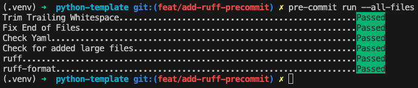
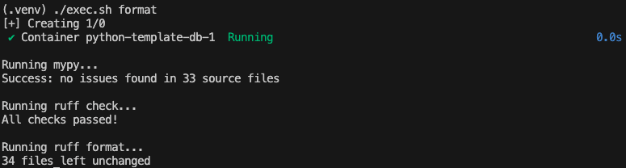
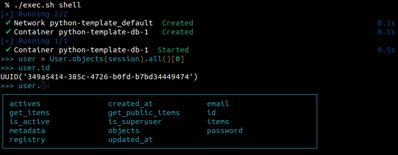
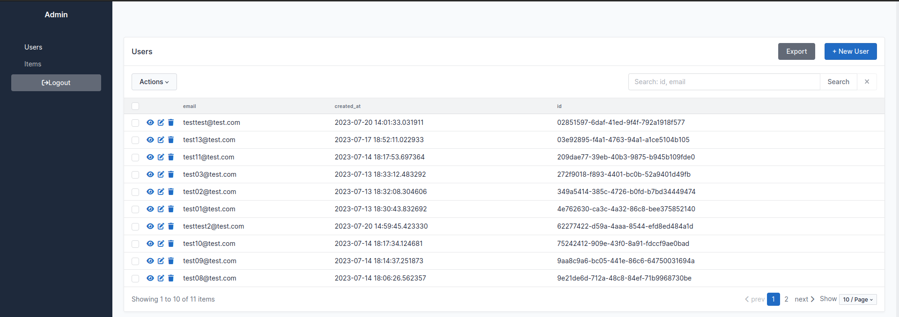

# Xmartlabs Python Template


## Components

- Rest API built with FastAPI and SQLAlchemy
- PostgreSQL database

## Project setup

The only things you need are [Docker](https://docs.docker.com/engine/install/), [Docker Compose](https://docs.docker.com/compose/install/), and a code editor with devcontainer support like [Visual Studio Code](https://code.visualstudio.com/download). Once you open the template with VS Code, it will recommend that you install the [Dev Containers extension](https://marketplace.visualstudio.com/items?itemName=ms-vscode-remote.remote-containers) if you don’t have it already. Then, a pop-up will appear to reopen the template in the devcontainer, or you can use `Ctrl / Cmd + shift + P` -> `Dev Containers: Open Folder in Container…`. Remember to add the `.env` file at the root folder; you can use `.env.example` as a reference.
Then you need to run `uv run python scripts/rename-template.py <new-project-name>` in order to modify the name of the project.

And that's it, everything is ready to use. By using the VS Code terminal with `Ctrl / Cmd + J`, you'll be inside the container to run any command or start the server with `uvicorn src.main:app --reload --host 0.0.0.0 --port 8000`.

You can connect to the container once it's running using `scripts/exec.sh bash` and execute commands from another terminal outside of VS Code. Also, for all the following commands that can be run inside the dev container, you can run `scripts/exec.sh {command}` from outside the container.

Once the containers and server are running, you can go to `http://localhost:8000/docs` to see the automatic interactive API documentation.

In case you don't to use VS Code and dev containers, or you want to set up the environment in a different way. You can use the `Dockerfile` in the root of the repository to create the image with everything needed to run the project. The `docker-compose.yaml` and `.env.example` files in the `.devcontainer` folder serve as references for recreating other services like the database. Also, you will need to run the `uv sync --frozen --no-cache --no-install-project --all-groups` command manually to install all the required dependencies.

Alternatively, you must have:

- `Python >3.13`
- [uv](https://docs.astral.sh/uv/getting-started/installation/) (don't forget to install the dependencies from the lock file)
- [PostgreSQL](https://www.postgresql.org/) database, setting the corresponding environment variables for the database connection.

For making code changes, installing `pre-commit` is necessary (see section [Code tools: pre-commit](#pre-commit))

### Customization

The project's name (`python-template`) can be edited following next steps:

1. Edit project's name in the [pyproject.toml](pyproject.toml) file
2. Set `PROJECT_NAME` env variable to be exactly the same as project's name in pyproject.toml. Ensure VSCode has this
variable loaded, otherwise the dev container might fail or not work as expected. You can open VScode with from cmd with:

```bash
PROJECT_NAME=your-awesome-project code <path/to/repo>
```

## Migrations

We use Alembic as database migration tool. You can run migration commands directly inside the dev container or use the provided shortcut in the `exec.sh` script.

- `migrate` – Runs all migrations.
- `makemigrations` – Compares the current database state with the table metadata and generates the necessary migration files.

## Code tools

Linters, formatters, etc.

- **ruff**: Linter and formatter
- **pyright**: Static type checker

### pre-commit

`pre-commit` is part of the `dev` group in the `pyproject.toml` and is installed by default.

Setup the `pre-commit` hooks, specified in `.pre-commit-config.yaml`:

    pre-commit install

Ensure everything was set up correctly by running the hooks:

    pre-commit run --all-files



#### Adding hooks

You can add new `pre-commit` hooks by editing `.pre-commit-config.yaml`. Whenever new hooks are added, you must run `pre-commit install` to ensure new hooks are run on commit.

There is a shortcut under the `/scripts` directory that runs all this tools for you (`./exec.sh format`) or just run `format` inside the dev container.



## Tests

We use FastAPI's `TestClient` and `pytest` for testing. `./exec.sh test` shortcut can be used to run all tests or just `test` inside the dev container.

## Shell

You can start an interactive Python shell inside the dev container in two ways:

1. Simply run `shell` inside the container.
2. Alternatively, use the `exec.sh shell` command.

The shell provides some useful pre-imported stuff:

- `session`: A SQLAlchemy `Session` object
- `settings`: An instance of the app settings class
- All the SQLAlchemy models classes



## Admin

The template includes an admin interface via [SQLAdmin](https://github.com/aminalaee/sqladmin). It's a flexible admin that can be configured in many ways.

*One note: You should be careful when adding relationships to the list or detail pages (specially large many-to-many / one-to-many relationships), because it's not very optimal in terms of DB querys in those cases (all the related objects would be loaded in memory).*



## Celery

The template includes a simple example of distributed tasks using [Celery](https://docs.celeryq.dev/en/stable/). There's an example endpoint which sends a task to the queue and then the celery worker will execute it. You can monitor the worker with [Flower](https://flower.readthedocs.io/en/latest/), to do so first execute `uv run celery -A src.task_queue.celery_worker flower --loglevel=info` and then go to `localhost:5555`.

In case you want to implement some real-world task you should modify the `src/task_queue/task.py` with your logic and then modify `src/api/v1/routers/task.py`.
Remember to always add all your tasks modules to the `src/task_queue/celery_worker.py` with `celery_worker.autodiscover_tasks(["path.to.your.task.module"])`.

## OpenTelemetry

A simple example of OpenTelemetry is included using the native FastAPI instrumentor to collect basic data of requests, also there is a custom instrument to collect data from the controllers. There is a simple implementation to monitor Celery to count the total tasks executed. Given that OpenTelemetry do not have a frontend, to see what is going on you should run `docker logs -f <otel-collector-container-id>`.

## Logging

This project uses [structlog](https://www.structlog.org/en/stable/) for structured logging.

Structured logs make it easier to parse, search, and analyze logs in production systems, especially when using centralized logging tools like Loki, ELK, or Datadog.

### Examples

1. Pass context information as key word arguments

```python
import structlog

log = structlog.get_logger()
# Pass extra information as key word arguments to log calls instead of wrapping them into the log message itself
log.info("user_logged_in", user_id="1234", method="password")
```

2. Bind additional context information to be used by any logger instance in scope

```python
import structlog
from structlog.contextvars import bound_contextvars

async def route_handler(user_id: str, session) -> User:
    with bound_contextvars(user_id=user_id):
        logger = structlog.get_logger(__name__)
        logger.info("Handling request XYZ")  # Will include user_id in the log entry

        user = await fetch_user(user_id, session)

        return user


async def fetch_user(user_id: str, session) -> User | None:
    logger = structlog.get_logger(__name__)
    log = logger.bind(class_name=User.__class__.name)
    user = await User.objects(session).get(User.id == user_id)

    if user is None:
        # This will include class_name and also user_id in the logs, as the logger is created
        # within the previous method's context.
        log.debug("Record not found")

    return user
```
